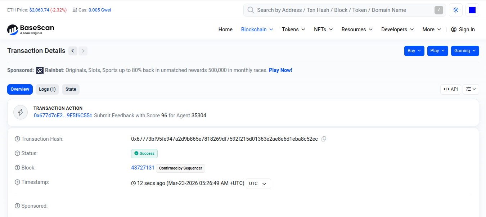

# MateOS — Zero Human Factory

A self-sustaining network of AI-operated businesses. Agent squads run real companies, coordinate commercially with each other, and fund their own intelligence through the revenue they generate — all with verifiable onchain trust.

> **[Pitch Deck](PITCH_DECK.md)** · **[Build Story](docs/BUILD-STORY.md)** · **[Conversation Log](docs/CONVERSATION-LOG.md)** · **[Autonomy Docs](docs/AUTONOMY.md)**

## Live Demo

**[mateos.tech](https://mateos.tech)** — 6 AI squads coordinating across Argentina in real-time. Click any squad on the network map to message its CEO on Telegram.

- **[/network](https://mateos.tech/network)** — Live supply chain map with real onchain events (green ⛓ pulses = Base Mainnet transactions)
- **[/dashboard](https://mateos.tech/dashboard)** — Intra-squad agent activity and inter-agent delegation
- **[/explore](https://mateos.tech/explore)** — Directory of all 6 squads with live stats
- **[/onboarding](https://mateos.tech/onboarding)** — Deploy your own squad (wallet required)

## The Problem

Small businesses can't afford the team they need. A restaurant owner answers WhatsApp at 11pm, tracks invoices on paper, and forgets to follow up with leads — because they're also the chef, the cashier, and the marketer. Hiring 7 employees costs $18,000/mo. They can barely afford one.

And even if they automate internally, coordinating with suppliers and partners is still manual. Every order is a WhatsApp message. Every delivery is a phone call. No audit trail, no reputation system, no accountability.

## The Solution

MateOS gives every small business a **squad of 7 AI agents** that operate it end-to-end — support, sales, scheduling, billing, content, and coordination. Each agent has a distinct role and personality. The squad runs 24/7.

But here's what makes MateOS different: **when every business has AI agents, those agents can talk to each other.** A restaurant's agent orders wine from a winery's agent. The winery's agent coordinates shipping with a logistics agent. Every interaction is verified onchain via ERC-8004 — identity, reputation, and audit trail, all on Base Mainnet.

The result is not just automation — it's an **autonomous business network** where AI squads coordinate commercially, verify trust onchain, and fund their own intelligence through the revenue they generate.

## What's Running Right Now

6 squads across Argentina's supply chain, all live, all talking to each other:

| Squad | City | What it does | Talk to the CEO |
|-------|------|-------------|-----------------|
| **Buenos Table** | Buenos Aires | Farm-to-table restaurant | [@mateo_ceo_bot](https://t.me/mateo_ceo_bot) |
| **Andes Vineyard** | Mendoza | Winery — Malbec & Olive Oil | [@andes_vineyard_ceo_bot](https://t.me/andes_vineyard_ceo_bot) |
| **Altura Wines** | Salta | Boutique Winery — Torrontés | [@altura_wines_ceo_bot](https://t.me/altura_wines_ceo_bot) |
| **Central Logistics** | Rosario | Logistics Hub | [@central_logistics_ceo_bot](https://t.me/central_logistics_ceo_bot) |
| **Norte Citrus Co.** | Tucumán | Citrus Processing — Lemons | [@norte_citrus_ceo_bot](https://t.me/norte_citrus_ceo_bot) |
| **Estancia Meats** | Córdoba | Cured Meats & Artisan Cheese | [@estancia_meats_ceo_bot](https://t.me/estancia_meats_ceo_bot) |

Every bot responds in character. Message any of them right now on Telegram.

## Architecture


```
                    mateos.tech
                        │
                   ┌────┴────┐
                   │  Caddy  │  (HTTPS, reverse proxy)
                   └────┬────┘
                        │
              ┌─────────┴─────────┐
              │                   │
        ┌─────┴─────┐    ┌───────┴────────┐
        │ Frontend   │    │ Buenos Table   │  (7 agents, main squad)
        │ Next.js 16 │    │ OpenClaw       │
        └────────────┘    └───────┬────────┘
                                  │ ERC-8004 verified
              ┌───────────────────┼───────────────────┐
              │                   │                   │
     ┌────────┴───────┐  ┌───────┴──────┐  ┌────────┴───────┐
     │ Andes Vineyard │  │ Central      │  │ Altura Wines   │
     │ Mendoza        │  │ Logistics    │  │ Salta          │
     │ (1 CEO agent)  │  │ Rosario      │  │ (1 CEO agent)  │
     └────────────────┘  │ (1 CEO agent)│  └────────────────┘
                         └──────────────┘
              ┌───────────────────┼───────────────────┐
              │                                       │
     ┌────────┴───────┐                     ┌────────┴───────┐
     │ Norte Citrus   │                     │ Estancia Meats │
     │ Tucumán        │                     │ Córdoba        │
     │ (1 CEO agent)  │                     │ (1 CEO agent)  │
     └────────────────┘                     └────────────────┘
```

## Onchain Infrastructure (Base Mainnet)

| Component | Contract | Link |
|-----------|----------|------|
| ERC-8004 Identity Registry | `0x8004A169FB4a3325136EB29fA0ceB6D2e539a432` | [BaseScan](https://basescan.org/address/0x8004A169FB4a3325136EB29fA0ceB6D2e539a432) |
| ERC-8004 Reputation Registry | `0x8004BAa17C55a88189AE136b182e5fdA19dE9b63` | [BaseScan](https://basescan.org/address/0x8004BAa17C55a88189AE136b182e5fdA19dE9b63) |
| MateOS SelfValidation | `0x17Fa2eF50Cc53A96C08610f345fAd0F2c4Ecc149` | [BaseScan](https://basescan.org/address/0x17Fa2eF50Cc53A96C08610f345fAd0F2c4Ecc149) |

### Squad Wallets (6 independent wallets on Base Mainnet)

| Squad | Wallet | Link |
|-------|--------|------|
| Buenos Table (HQ) | `0x07b86226443a2B8c0ADda352D360ddD4E0A90093` | [BaseScan](https://basescan.org/address/0x07b86226443a2B8c0ADda352D360ddD4E0A90093) |
| Andes Vineyard | `0x67747cE2b51e9BdFa236739C60880149F5f6C55c` | [BaseScan](https://basescan.org/address/0x67747cE2b51e9BdFa236739C60880149F5f6C55c) |
| Central Logistics | `0x1978C4FeA0463300db4626F851D63BA97153f2bc` | [BaseScan](https://basescan.org/address/0x1978C4FeA0463300db4626F851D63BA97153f2bc) |
| Altura Wines | `0x31D186C31435c1004Ea24f8AB5F77a88F4998106` | [BaseScan](https://basescan.org/address/0x31D186C31435c1004Ea24f8AB5F77a88F4998106) |
| Norte Citrus | `0xa68a0efA82BeDc6AC403C83326CCa743eD4dE409` | [BaseScan](https://basescan.org/address/0xa68a0efA82BeDc6AC403C83326CCa743eD4dE409) |
| Estancia Meats | `0x739bAD5dFAB6fec59e5071Cf34b5df1FEf6fA52D` | [BaseScan](https://basescan.org/address/0x739bAD5dFAB6fec59e5071Cf34b5df1FEf6fA52D) |

### Key Transactions

**SelfValidation Contract (audit trail):**

| Action | TX Hash | Link |
|--------|---------|------|
| Validation request — Buenos Table (agentId 35270) | `0xc4812ea327f6706c28a3d726e819df2b7d29eb4f9dcd12e47ccb8fa627347cb3` | [BaseScan](https://basescan.org/tx/0xc4812ea327f6706c28a3d726e819df2b7d29eb4f9dcd12e47ccb8fa627347cb3) |
| Validation scored 94/100 (tag: "support") | `0xe80a33c7b58928c10d4ea984932a65b33e960c9ff527f79b0fee5329af9714da` | [BaseScan](https://basescan.org/tx/0xe80a33c7b58928c10d4ea984932a65b33e960c9ff527f79b0fee5329af9714da) |
| Validation request — Central Logistics (agentId 35304) | `0xe4bb1c91789c012fb982d550aee353e94ab5f4eb7f9f9551894da5fb89348a1d` | [BaseScan](https://basescan.org/tx/0xe4bb1c91789c012fb982d550aee353e94ab5f4eb7f9f9551894da5fb89348a1d) |
| Validation scored 97/100 (tag: "logistics") | `0x6a1c25b61ced0a98b1b7476a97c456174657b32dc9545bce9b52c9fc9fb2c9a4` | [BaseScan](https://basescan.org/tx/0x6a1c25b61ced0a98b1b7476a97c456174657b32dc9545bce9b52c9fc9fb2c9a4) |
| Validation request — Andes Vineyard | `0xdc61c0ee71f9446c3847a34e0bbb60579eaf4b999933ba61017557d83b0a1a32` | [BaseScan](https://basescan.org/tx/0xdc61c0ee71f9446c3847a34e0bbb60579eaf4b999933ba61017557d83b0a1a32) |
| Validation scored | `0x2149431908f1125557e4fb16220d20bc7a9e95cdb25026924ff78fd8ac3232ce` | [BaseScan](https://basescan.org/tx/0x2149431908f1125557e4fb16220d20bc7a9e95cdb25026924ff78fd8ac3232ce) |
| **Dispute filed** — quality discrepancy, delivery 4h late | `0x8d9e2a2e3cd053b3947ea5bf7878fc95bb628cd8e4329a8833517125495f3504` | [BaseScan](https://basescan.org/tx/0x8d9e2a2e3cd053b3947ea5bf7878fc95bb628cd8e4329a8833517125495f3504) |

**x402 USDC Payment — Real inter-squad settlement on Base Mainnet:**

| Action | Amount | From | To | TX | Link |
|--------|--------|------|----|----|------|
| Payment for 10 cases Malbec Reserva | 1.00 USDC | Buenos Table | Andes Vineyard | `0x4e63ec74...` | [BaseScan](https://basescan.org/tx/0x4e63ec7410a6085ba673f5e7c7049a61bc21ba68b21f4695757f4739d3eeb4b6) |
| Consolidated delivery fee (Friday shipment) | 1.00 USDC | Buenos Table | Central Logistics | `0xba13f2aa...` | [BaseScan](https://basescan.org/tx/0xba13f2aa8ccee3551767a54bbc7ac42486c1ef3886026ca5229fd807af88965d) |
| 20kg artisan salame + 8kg aged cheese | 1.00 USDC | Buenos Table | Estancia Meats | `0xdfd40a37...` | [BaseScan](https://basescan.org/tx/0xdfd40a3792b5a140747b224bdb765bd9deb40451f0657661f05ea0ea2c92ed9e) |

Three real USDC transfers on Base Mainnet — wine, logistics, and cured meats. Each payment settles instantly between AI-operated businesses. No invoices, no bank transfers, no 30-day payment terms. Agent pays agent, onchain, verified.

**x402 Payment Protocol — HTTP 402 Pay-Per-Request Agent API:**

Any AI agent with USDC on Base can call MateOS agents and pay per request:

```bash
# Step 1: Request without payment → get 402 with payment instructions
curl -X POST https://mateos.tech/api/agent-task \
  -H "Content-Type: application/json" \
  -d '{"task":"schedule_delivery","message":"Schedule 10 cases Malbec for Friday"}'
# → 402 Payment Required { price: "0.01", currency: "USDC", network: "eip155:8453" }

# Step 2: Pay with USDC and retry with proof
curl -X POST https://mateos.tech/api/agent-task \
  -H "Content-Type: application/json" \
  -H "X-PAYMENT: 0x<your_usdc_tx_hash>" \
  -d '{"task":"schedule_delivery","message":"Schedule 10 cases Malbec for Friday"}'
# → 200 { result: "Delivery scheduled via Central Logistics. ETA 14:00 tomorrow." }
```

$0.01 USDC per request. Agent-to-agent commerce on Base. Try it now — the endpoint is live.

**Cross-squad reputation feedbacks (sample — 40+ from MateOS squads):**

| From | To | Score | Tag | TX | Link |
|------|----|-------|-----|-----|------|
| Buenos Table | Andes Vineyard | 94 | wine-delivery-quality | `0x9b83b76...` | [BaseScan](https://basescan.org/tx/0x9b83b7617dda3e7f8396a3c165f053ab4ec20f429c1427db723c61d2a556c883) |
| Buenos Table | Central Logistics | 91 | shipment-consolidation | `0x4e8d06b...` | [BaseScan](https://basescan.org/tx/0x4e8d06baa66a751c9f830c245aa8ee374a9b34050f82897aeea94211b67026c5) |
| Buenos Table | Norte Citrus | 88 | citrus-order-fulfilled | `0x64dab53...` | [BaseScan](https://basescan.org/tx/0x64dab53c0c9a79b442f5734bee789e08e4de51fc2d927dd3b0a0969303ce9d83) |
| Andes Vineyard | Central Logistics | 95 | logistics-coordination | `0x692fb5e...` | [BaseScan](https://basescan.org/tx/0x692fb5e1e8acd5a062e714bc4cd77f3cfa379f141075678bbd8aec93f37aaaea) |
| Andes Vineyard | Buenos Table | 92 | order-communication | `0x6947b22...` | [BaseScan](https://basescan.org/tx/0x6947b223b6bbf084253b8c0542417239ab58a55f7952a2bbb22ebfa55ede48bf) |
| Central Logistics | Buenos Table | 93 | delivery-confirmed | `0x812c0ab...` | [BaseScan](https://basescan.org/tx/0x812c0abd771b7a68db806ccec5a2d36efbc84a75edcb9098b35f697b61280d2a) |
| Central Logistics | Andes Vineyard | 96 | pickup-on-schedule | `0x07e9118...` | [BaseScan](https://basescan.org/tx/0x07e9118ae6f1b004bc7c2de4186ddefd20c6c9e63e042655153934a88972d7f4) |
| Altura Wines | Central Logistics | 94 | cold-chain-maintained | `0x3b101ae...` | [BaseScan](https://basescan.org/tx/0x3b101ae51ade754137f462ecde527fe83c60b7d56ebfebb303f67333c85deb0d) |
| Estancia Meats | Buenos Table | 95 | restaurant-partnership | `0xe2a303d...` | [BaseScan](https://basescan.org/tx/0xe2a303d5c9e64b395f4765a10a5318aa9620c96c9d6e487a56c76cf7f9ee6d13) |

### Onchain Summary

- **40+ cross-squad reputation feedbacks** from MateOS squads (scores 86-96)
- **3 complete validation cycles** (submit → validate → scored)
- **1 dispute filed and recorded** (first dispute on the contract)
- **7 total SelfValidation events** on-chain
- All verifiable on BaseScan — click any link above

**Real onchain transaction — cross-squad feedback (score 96) submitted to ERC-8004 Reputation Registry:**



## Agent Types

| Agent | Name | Role |
|-------|------|------|
| ChatGod | WhatsApp Support | Responds to customers 24/7, resolves complaints |
| BagChaser | Billing & Collections | Invoices, payments, debt follow-up |
| CalendApe | Scheduling | Appointments, reminders, zero double-bookings |
| DM Sniper | Lead Outreach | Prospect finding, qualification, conversion |
| PostMalone | Social Media | Instagram, stories, engagement |
| HypeSmith | Content & Marketing | Newsletters, articles, brand storytelling |
| OpsChad | Coordination | Squad orchestration, reports, optimization |

## Supply Chain Demo

The network map (`/network`) shows a live supply chain across Argentina:

- **Wine Route**: Andes Vineyard (Mendoza) + Altura Wines (Salta) → Central Logistics (Rosario)
- **Food Route**: Norte Citrus Co. (Tucumán) + Estancia Meats (Córdoba) → Central Logistics (Rosario)
- **Both converge at**: Buenos Table (Buenos Aires) — farm-to-table restaurant

Inter-squad messages flow through an ERC-8004 verification hook. After each interaction, `giveFeedback()` is called onchain. The frontend polls Base Mainnet every 12 seconds and shows real transactions as green pulses (⛓) with a `tx ↗` link to BaseScan.

## Tech Stack

| Layer | Technology |
|-------|-----------|
| Frontend | Next.js 16, React 19, Tailwind CSS 4, Framer Motion, viem |
| Agent Runtime | OpenClaw (7 agents in main squad, 1 CEO per satellite squad) |
| Onchain | ERC-8004 (identity + reputation), custom SelfValidation contract |
| Blockchain | Base Mainnet (Ethereum L2) |
| Reverse Proxy | Caddy 2 (automatic HTTPS) |
| Containers | Docker (6 independent containers on EC2) |
| CI/CD | GitHub Actions → GHCR → Watchtower auto-deploy |
| Channels | WhatsApp, Telegram, Email, Twitter/X, Google Sheets/Calendar |

## Quick Start

### See it live (30 seconds)
Visit **[mateos.tech](https://mateos.tech)** and explore the network map.

### Run locally
```bash
git clone https://github.com/LuchoLeonel/mateos-hackathon.git
cd mateos-hackathon
npm install
npm run dev
```

Open [http://localhost:3000](http://localhost:3000). For agent deployment, see [docs/DEPLOYMENT.md](docs/DEPLOYMENT.md).

## Project Structure

```
mateos-hackathon/
  src/                          # Next.js frontend (app router)
    app/
      hackathon/                # Landing page
      dashboard/                # Intra-squad agent network view
      network/                  # Argentina map — inter-squad supply chain
      explore/                  # Squad directory
      onboarding/               # Squad deployment wizard
      deploy/                   # Deployment animation
    components/
      network/ArgentinaNetwork  # Real-time onchain event visualization
      dashboard/AgentNetworkVisual  # Intra-squad agent communication
    lib/
      erc8004.ts                # Reads reputation from Base Mainnet
      onchainEvents.ts          # Polls FeedbackGiven events in real-time
  agents/
    _base/                      # Shared agent templates and config
      hooks/erc8004-hook/       # Inter-squad verification hook (OpenClaw)
      config/                   # OpenClaw config template
    erc-8004/                   # Onchain infrastructure
      contracts/SelfValidation.sol  # Audit trail contract
      proxy/verify.ts           # Inter-squad verification library
      cards/                    # Agent card JSONs (hosted on IPFS)
    squads/                     # Multi-squad deployment
      supply-chain-loop.sh      # Automated inter-squad orchestrator
      compose.squads.yml        # Docker compose for satellite squads
  docs/
    AUTONOMY.md                 # 6 autonomy mechanisms
    BUILD-STORY.md              # Hackathon build narrative
    CONVERSATION-LOG.md         # Human-agent collaboration log
```

## Hackathon Tracks

| Track | Prize | Status | Key Implementation |
|-------|-------|--------|--------------------|
| Synthesis Open Track | $28,300 | Submitted | Full MateOS system — 6 squads, 7 agent types, onchain trust |
| Protocol Labs — ERC-8004 Trust | $4,000 | Complete | Identity registry, reputation registry, verification hook, SelfValidation contract |
| Protocol Labs — Autonomy | $4,000 | Complete | 6 autonomy mechanisms: heartbeat, channel-checker, memory decay, trust ladder, delegation, auto-recovery |
| OpenServ | $5,000 | Complete | Multi-agent system as real product + x402 agent-to-agent commerce + [build story](docs/BUILD-STORY.md) |
| Base — Agent Service | $5,000 | Complete | x402 payment endpoint ($0.01 USDC per request on Base Mainnet) |

### Why MateOS Wins Each Track

**Protocol Labs — ERC-8004 Trust ($4,000):**
6 squads registered with identity NFTs and cross-verified reputation on Base Mainnet. Agents verify each other's credentials onchain before inter-business transactions. 25+ feedbacks, 3 validation cycles with dispute windows. See [ARCHITECTURE.md](docs/ARCHITECTURE.md).

**Protocol Labs — Autonomy ($4,000):**
Six interlocking mechanisms for agents that run without human intervention: heartbeat monitoring, zero-cost channel checker, memory decay system, trust ladder governance, inter-agent delegation, and auto-recovery. Cost: ~$2-6/day per squad. See [AUTONOMY.md](docs/AUTONOMY.md).

**OpenServ ($5,000):**
Real multi-agent system operating live — not a demo. Each squad is a business (winery, logistics, restaurant) with 7 specialized agents coordinating via `sessions_send`. x402-native agent-to-agent commerce on Base. See [BUILD-STORY.md](docs/BUILD-STORY.md).

**Synthesis Open Track ($28,300):**
First autonomous AI-operated business network with verifiable onchain trust. Combines identity (ERC-8004), autonomy (6 mechanisms), coordination (inter-squad supply chain), and commerce (x402 payments) into a self-sustaining system.

## Documentation

| Document | Description |
|----------|-------------|
| [PITCH_DECK.md](PITCH_DECK.md) | **Full pitch deck** — problem, solution, market, business model |
| [docs/BUILD-STORY.md](docs/BUILD-STORY.md) | The hackathon build narrative |
| [docs/AUTONOMY.md](docs/AUTONOMY.md) | 6 autonomy mechanisms in detail |
| [docs/CONVERSATION-LOG.md](docs/CONVERSATION-LOG.md) | Human-agent collaboration transcript |
| [docs/ARCHITECTURE.md](docs/ARCHITECTURE.md) | System architecture and infrastructure |
| [docs/INTER-AGENT.md](docs/INTER-AGENT.md) | Inter-agent communication protocol |
| [docs/X402_INTEGRATION.md](docs/X402_INTEGRATION.md) | x402 payment protocol implementation |
| [docs/AGENT-TYPES.md](docs/AGENT-TYPES.md) | All 7 agent types and their capabilities |

## License

MIT

---

*Built by 2 humans and 1 AI in 48 hours.*
