# MateOS — System Flow Diagram

> Copy the Mermaid code into [Excalidraw](https://excalidraw.com) or [mermaid.live](https://mermaid.live) to render.

```mermaid
flowchart TB
    subgraph USER["USER / EXTERNAL AGENT"]
        Customer["Customer\nWhatsApp / Telegram / Email"]
        ExtAgent["External AI Agent\nany agent with USDC on Base"]
    end

    subgraph FRONTEND["FRONTEND — mateos.tech"]
        Network["/network\nArgentina Map + Live Onchain Events"]
        Dashboard["/dashboard\nAgent Network + Activity Feed"]
        Onboarding["/onboarding\nSquad Deployment Wizard"]
    end

    subgraph X402["x402 PAYMENT PROTOCOL\n--- BASE TRACK + OPENSERV ---"]
        Endpoint["POST /api/agent-task\n$0.01 USDC per request"]
        Facilitator["Coinbase Facilitator\nverify + settle USDC"]
    end

    subgraph HQ["BUENOS TABLE HQ — 7 AGENTS\n--- OPENSERV ---"]
        CEO["OpsChad\nCoordination"]
        ChatGod["ChatGod\nWhatsApp"]
        BagChaser["BagChaser\nBilling"]
        CalendApe["CalendApe\nScheduling"]
        DMSniper["DM Sniper\nOutreach"]
        PostMalone["PostMalone\nSocial"]
        HypeSmith["HypeSmith\nContent"]
    end

    subgraph SQUADS["SATELLITE SQUADS — 5 CEOs"]
        Andes["Andes Vineyard\nMendoza"]
        Central["Central Logistics\nRosario"]
        Altura["Altura Wines\nSalta"]
        Citrus["Norte Citrus\nTucuman"]
        Estancia["Estancia Meats\nCordoba"]
    end

    subgraph AUTONOMY["6 AUTONOMY MECHANISMS\n--- PROTOCOL LABS AUTONOMY ---"]
        Heartbeat["Heartbeat\nHaiku $0.02/day"]
        ChannelChk["Channel Checker\nPython $0 cost"]
        MemDecay["Memory Decay\nhot / warm / cold"]
        TrustLadder["Trust Ladder\n4 levels"]
        Delegation["Delegation\nsessions_send depth≤3"]
        Recovery["Auto-Recovery\nDocker healthcheck"]
    end

    subgraph ONCHAIN["BASE MAINNET — ERC-8004\n--- PROTOCOL LABS TRUST ---"]
        Identity["Identity Registry\n0x8004A169..."]
        Reputation["Reputation Registry\n0x8004BAa1..."]
        SelfVal["SelfValidation\n0x17Fa2eF5..."]
        Hook["Verification Hook\ncheck identity + rep >= 70"]
    end

    subgraph BANKR["BANKR — SELF-FUNDING LOOP\n--- BANKR TRACK ---"]
        Token["$MATEOS Token\nBase Mainnet"]
        SwapFees["Swap Fees\n1.2% per trade"]
        Gateway["Bankr LLM Gateway\nllm.bankr.bot"]
        Credits["Inference Credits\nauto top-up"]
    end

    %% === CUSTOMER FLOW ===
    Customer -->|message| ChannelChk
    ChannelChk -->|wake agent| ChatGod
    ChatGod -->|delegate lead| DMSniper
    DMSniper -->|delegate schedule| CalendApe
    CalendApe -->|delegate invoice| BagChaser

    %% === x402 FLOW ===
    ExtAgent -->|POST without payment| Endpoint
    Endpoint -->|402 Payment Required| ExtAgent
    ExtAgent -->|retry with X-PAYMENT| Endpoint
    Endpoint -->|verify proof| Facilitator
    Facilitator -->|settle USDC| CEO

    %% === FRONTEND READS ONCHAIN ===
    Network -->|poll 12s| Reputation
    Dashboard -->|getSquadReputation| Reputation
    Onboarding -->|register-squad| Identity

    %% === INTER-SQUAD TRUST ===
    CEO -->|inter-squad request| Hook
    Hook -->|verify| Identity
    Hook -->|check score| Reputation
    Hook -->|verified| Andes
    Hook -->|verified| Central
    Hook -->|verified| Estancia

    %% === FEEDBACK ONCHAIN ===
    Andes -->|giveFeedback 94| Reputation
    Central -->|giveFeedback 96| Reputation
    Estancia -->|giveFeedback 95| Reputation

    %% === USDC PAYMENTS ===
    CEO -->|1.00 USDC wine| Andes
    CEO -->|1.00 USDC logistics| Central
    CEO -->|1.00 USDC meats| Estancia

    %% === SELF-VALIDATION ===
    CEO -->|submitValidation| SelfVal
    Andes -->|respondValidation 97| SelfVal
    Andes -->|disputeValidation| SelfVal

    %% === BANKR LOOP ===
    Token -->|trades| SwapFees
    SwapFees -->|57% treasury| Credits
    Credits -->|auto top-up| Gateway
    Gateway -->|LLM inference| CEO
    Gateway -->|LLM inference| ChatGod
    CEO -->|revenue generates demand| Token

    %% === AUTONOMY ===
    Heartbeat -.->|health check| CEO
    TrustLadder -.->|draft + approve| ChatGod
    MemDecay -.->|decay old context| CEO
    Recovery -.->|restart on crash| HQ

    %% === INTERNAL COORDINATION ===
    CEO <-->|sessions_send| ChatGod
    CEO <-->|sessions_send| BagChaser
    CEO <-->|sessions_send| CalendApe

    %% === STYLING ===
    classDef user fill:#FFEAA7,stroke:#F39C12,stroke-width:2px,color:#000
    classDef frontend fill:#DFE6E9,stroke:#636E72,stroke-width:2px,color:#000
    classDef x402 fill:#74B9FF,stroke:#0984E3,stroke-width:3px,color:#000
    classDef agents fill:#FD79A8,stroke:#E84393,stroke-width:2px,color:#000
    classDef squads fill:#FDCB6E,stroke:#E17055,stroke-width:2px,color:#000
    classDef autonomy fill:#A29BFE,stroke:#6C5CE7,stroke-width:3px,color:#000
    classDef onchain fill:#55EFC4,stroke:#00B894,stroke-width:3px,color:#000
    classDef bankr fill:#FAB1A0,stroke:#E17055,stroke-width:3px,color:#000
    classDef infra fill:#B2BEC3,stroke:#636E72,stroke-width:1px,color:#000

    class USER user
    class FRONTEND frontend
    class X402 x402
    class HQ agents
    class SQUADS squads
    class AUTONOMY autonomy
    class ONCHAIN onchain
    class BANKR bankr

    class Customer,ExtAgent user
    class Network,Dashboard,Onboarding frontend
    class Endpoint,Facilitator x402
    class CEO,ChatGod,BagChaser,CalendApe,DMSniper,PostMalone,HypeSmith agents
    class Andes,Central,Altura,Citrus,Estancia squads
    class Heartbeat,ChannelChk,MemDecay,TrustLadder,Delegation,Recovery autonomy
    class Identity,Reputation,SelfVal,Hook onchain
    class Token,SwapFees,Gateway,Credits bankr
```

## Track Legend

| Color | Block | Track | Prize |
|-------|-------|-------|-------|
| 🟢 Green | Base Mainnet — ERC-8004 | Protocol Labs — Trust | $4,000 |
| 🟣 Purple | 6 Autonomy Mechanisms | Protocol Labs — Autonomy | $4,000 |
| 🔵 Blue | x402 Payment Protocol | Base + OpenServ | $5,000 + $5,000 |
| 🟠 Orange/Salmon | Bankr Self-Funding Loop | Bankr | $7,590 |
| 🩷 Pink | Agent Runtime (7 agents) | OpenServ | $5,000 |
| 🟡 Yellow | Satellite Squads | Open Track | $28,300 |
| ⬜ Gray | Frontend + Infra | All tracks | — |

## Key Flows

1. **Customer → Channel Checker → Agent → Delegate → Response** (Autonomy)
2. **External Agent → 402 → Pay USDC → Facilitator → Agent executes** (Base + OpenServ)
3. **Squad A → Hook → Verify Identity + Rep ≥ 70 → Squad B → giveFeedback()** (ERC-8004)
4. **$MATEOS trades → Fees → Credits → LLM Gateway → Agent works → Revenue** (Bankr)
5. **submitValidation() → respondValidation(97) → disputeValidation()** (ERC-8004)
6. **Buenos Table → 1.00 USDC → Andes / Central / Estancia** (Base — real payments)
