# MateOS — System Flow Diagram

> Copy this Mermaid code into [Excalidraw](https://excalidraw.com) (paste as Mermaid) to generate an editable diagram.

```mermaid
flowchart TB
    subgraph USER["🧑 User / External Agent"]
        Customer["Customer<br/>(WhatsApp / Telegram / Email)"]
        ExtAgent["External AI Agent<br/>(any agent with USDC)"]
    end

    subgraph FRONTEND["🌐 Frontend — mateos.tech<br/><i>Next.js 16 + React 19 + Tailwind</i>"]
        Network["/network<br/>Argentina Supply Chain Map"]
        Dashboard["/dashboard<br/>Agent Network Visual"]
        Explore["/explore<br/>Squad Directory"]
        Onboarding["/onboarding → /deploy<br/>Squad Deployment Wizard"]
    end

    subgraph X402["💳 x402 Payment Protocol<br/>🏷️ BASE TRACK + OPENSERV"]
        Endpoint["POST /api/agent-task<br/>$0.01 USDC per request"]
        Verify["verifyPayment()<br/>Coinbase Facilitator"]
        USDC["USDC on Base Mainnet<br/>0x833589fCD6eDb6E..."]
    end

    subgraph AGENTS["🤖 Agent Runtime — OpenClaw<br/>🏷️ OPENSERV + AUTONOMY"]
        subgraph HQ["Buenos Table HQ — 7 Agents"]
            CEO["OpsChad<br/>(Coordination)"]
            ChatGod["ChatGod<br/>(WhatsApp Support)"]
            BagChaser["BagChaser<br/>(Billing)"]
            CalendApe["CalendApe<br/>(Scheduling)"]
            DMSniper["DM Sniper<br/>(Outreach)"]
            PostMalone["PostMalone<br/>(Social)"]
            HypeSmith["HypeSmith<br/>(Content)"]
        end

        subgraph SQUADS["Satellite Squads — 1 CEO each"]
            Andes["Andes Vineyard<br/>(Mendoza)"]
            Central["Central Logistics<br/>(Rosario)"]
            Altura["Altura Wines<br/>(Salta)"]
            Citrus["Norte Citrus<br/>(Tucumán)"]
            Estancia["Estancia Meats<br/>(Córdoba)"]
        end

        subgraph AUTONOMY["⚡ 6 Autonomy Mechanisms<br/>🏷️ PROTOCOL LABS — AUTONOMY"]
            Heartbeat["Heartbeat System<br/>(Haiku, $0.02/day)"]
            ChannelChk["Channel Checker<br/>(Python, $0 cost)"]
            MemDecay["Memory Decay<br/>(hot → warm → cold)"]
            TrustLadder["Trust Ladder<br/>(4 levels, earned)"]
            Delegation["Inter-Agent Delegation<br/>(sessions_send, depth≤3)"]
            Recovery["Auto-Recovery<br/>(Docker healthcheck)"]
        end
    end

    subgraph ONCHAIN["⛓️ Base Mainnet — ERC-8004<br/>🏷️ PROTOCOL LABS — ERC-8004 TRUST"]
        Identity["Identity Registry<br/>0x8004A169..."]
        Reputation["Reputation Registry<br/>0x8004BAa1..."]
        SelfVal["SelfValidation Contract<br/>0x17Fa2eF5..."]
        Hook["ERC-8004 Verification Hook<br/>(check identity + reputation ≥ 70)"]
    end

    subgraph BANKR["🏦 Bankr — Self-Funding Loop<br/>🏷️ BANKR TRACK"]
        Token["$MATEOS Token<br/>(Base Mainnet)"]
        SwapFees["Swap Fees<br/>(1.2% per trade)"]
        Gateway["Bankr LLM Gateway<br/>(llm.bankr.bot)"]
        Credits["Inference Credits<br/>(auto top-up)"]
    end

    subgraph INFRA["🏗️ Infrastructure"]
        Docker["Docker Containers<br/>(EC2 + Caddy HTTPS)"]
        CICD["GitHub Actions<br/>→ GHCR → Watchtower"]
        Channels["WhatsApp / Telegram<br/>Email / Twitter / Sheets"]
    end

    %% User flows
    Customer -->|"message"| Channels
    Channels -->|"channel-checker polls"| ChannelChk
    ChannelChk -->|"wake agent"| ChatGod
    ExtAgent -->|"POST + USDC"| Endpoint

    %% x402 flow
    Endpoint -->|"no payment"| ExtAgent
    Endpoint -->|"X-PAYMENT header"| Verify
    Verify -->|"settle USDC"| USDC
    USDC -->|"payment confirmed"| CEO
    Endpoint -.->|"402 → pay → retry"| ExtAgent

    %% Frontend reads onchain
    Network -->|"poll every 12s"| Reputation
    Dashboard -->|"getSquadReputation()"| Reputation
    Onboarding -->|"register-squad API"| Identity

    %% Internal agent coordination
    CEO <-->|"sessions_send"| ChatGod
    CEO <-->|"sessions_send"| BagChaser
    CEO <-->|"sessions_send"| CalendApe
    CEO <-->|"sessions_send"| DMSniper
    ChatGod -->|"delegate lead"| DMSniper
    DMSniper -->|"delegate schedule"| CalendApe
    CalendApe -->|"delegate invoice"| BagChaser

    %% Inter-squad communication
    CEO -->|"inter-squad request"| Hook
    Hook -->|"verify identity"| Identity
    Hook -->|"check reputation ≥ 70"| Reputation
    Hook -->|"✓ verified"| Andes
    Hook -->|"✓ verified"| Central
    Andes -->|"giveFeedback(score)"| Reputation
    Central -->|"giveFeedback(score)"| Reputation
    Estancia -->|"giveFeedback(score)"| Reputation

    %% SelfValidation
    CEO -->|"submitValidation()"| SelfVal
    Andes -->|"respondValidation(score)"| SelfVal
    Andes -->|"disputeValidation()"| SelfVal

    %% USDC payments between squads
    CEO -->|"1.00 USDC"| Andes
    CEO -->|"1.00 USDC"| Central
    CEO -->|"1.00 USDC"| Estancia

    %% Bankr self-funding loop
    Token -->|"trades"| SwapFees
    SwapFees -->|"57% to treasury"| Credits
    Credits -->|"auto top-up"| Gateway
    Gateway -->|"LLM inference"| CEO
    Gateway -->|"LLM inference"| ChatGod
    CEO -->|"revenue"| Token

    %% Autonomy mechanisms
    Heartbeat -->|"check health"| CEO
    TrustLadder -->|"level 2: draft+approve"| Channels
    MemDecay -->|"7d hot → 30d warm"| CEO
    Recovery -->|"restart on crash"| Docker

    %% Infrastructure
    Docker -->|"hosts"| HQ
    Docker -->|"hosts"| SQUADS
    CICD -->|"auto-deploy"| Docker

    %% Styling
    classDef track fill:#1a1a2e,stroke:#C4A35A,stroke-width:2px,color:#fff
    classDef erc8004 fill:#0d1b2a,stroke:#10B981,stroke-width:2px,color:#fff
    classDef autonomy fill:#0d1b2a,stroke:#8B5CF6,stroke-width:2px,color:#fff
    classDef bankr fill:#0d1b2a,stroke:#F97316,stroke-width:2px,color:#fff
    classDef x402 fill:#0d1b2a,stroke:#06B6D4,stroke-width:2px,color:#fff
    classDef agent fill:#12121F,stroke:#EAB308,stroke-width:1px,color:#fff

    class ONCHAIN erc8004
    class AUTONOMY autonomy
    class BANKR bankr
    class X402 x402
    class CEO,ChatGod,BagChaser,CalendApe,DMSniper,PostMalone,HypeSmith agent
```

## Track Legend

| Color | Track | Prize |
|-------|-------|-------|
| 🟢 Green border | Protocol Labs — ERC-8004 Trust | $4,000 |
| 🟣 Purple border | Protocol Labs — Autonomy | $4,000 |
| 🟠 Orange border | Bankr — Self-Funding Loop | $7,590 |
| 🔵 Cyan border | Base + OpenServ — x402 Payments | $5,000 + $5,000 |
| 🟡 Gold border | Open Track (everything) | $28,300 |

## Key Flows to Highlight in Excalidraw

1. **Customer → Agent → Response** (Autonomy track)
2. **External Agent → x402 → Pay USDC → Get Result** (Base + OpenServ tracks)
3. **Squad A → ERC-8004 Hook → Verify → Squad B → Feedback onchain** (ERC-8004 track)
4. **Token trades → Fees → Credits → LLM → Agent works → Revenue** (Bankr track)
5. **Submit → Validate → Dispute** (ERC-8004 SelfValidation)
